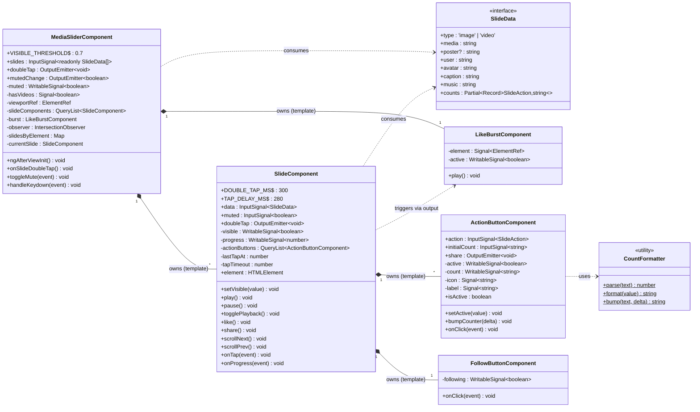
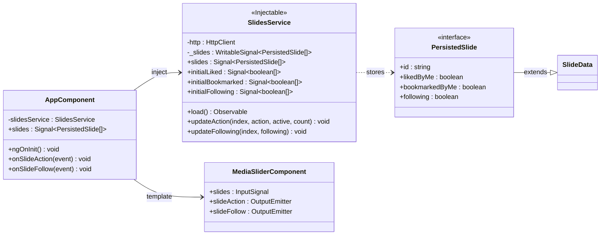
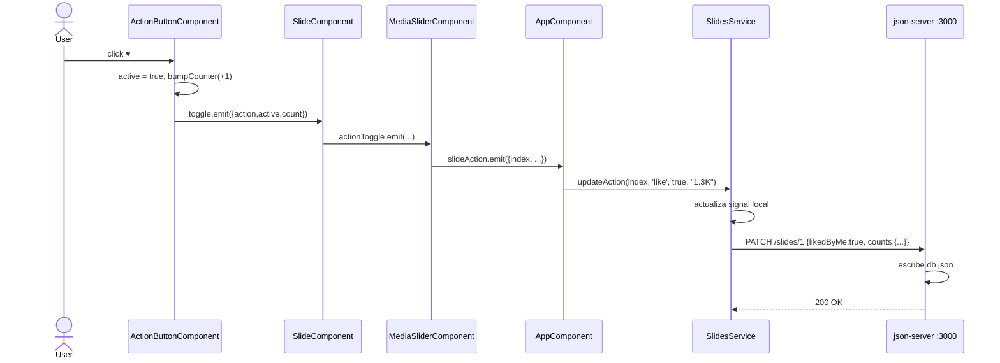
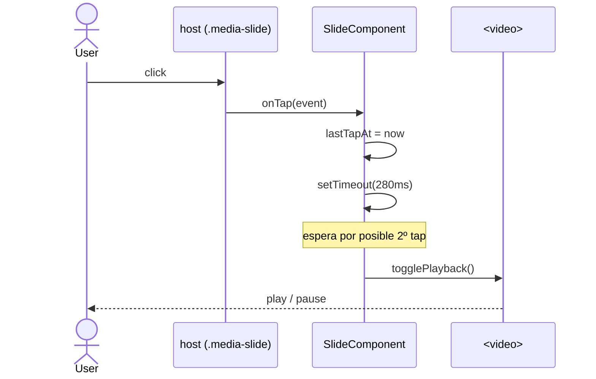
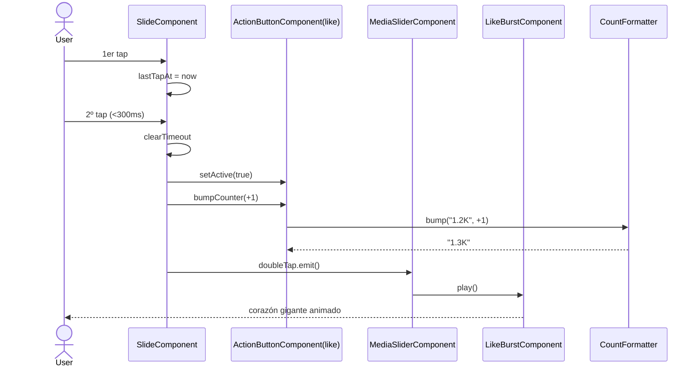
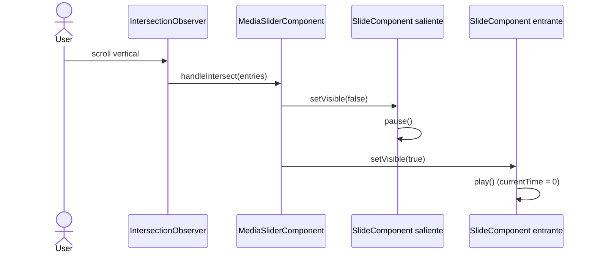
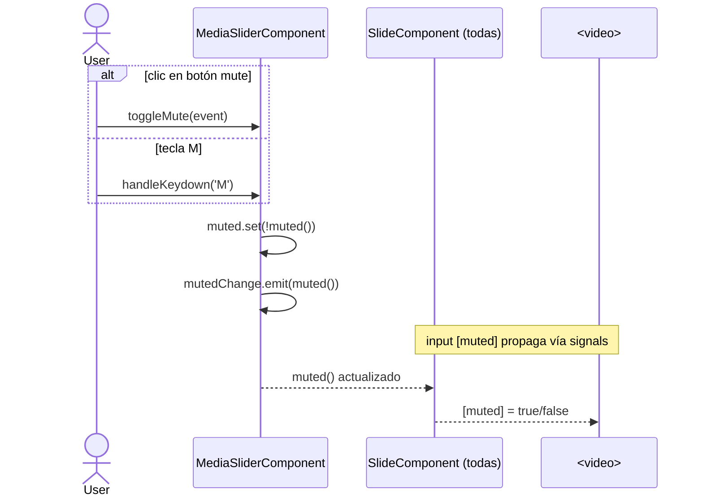
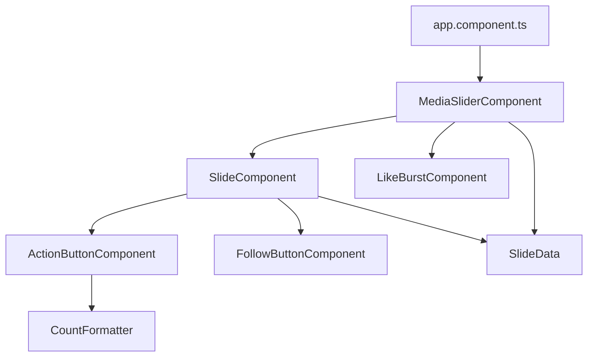

# Diagrama de clases — Media Slider (Angular)

> Este diagrama corresponde a la librería `media-slider` que vive en
> `angular-slider/projects/media-slider/`. Si buscas la versión vanilla JS,
> consulta el historial de git.

## Vista general



> La librería expone además outputs agregados a nivel de slider:
> `slideAction: { index, action, active, count }` y
> `slideFollow: { index, following }`, más inputs opcionales para hidratar
> el estado inicial de cada slide (`initialLiked`, `initialBookmarked`,
> `initialFollowing`). Gracias a eso la capa de persistencia puede vivir
> **fuera** de la librería, como se ve en la siguiente sección.

## Capa de persistencia (app consumidora)

La librería no sabe nada de HTTP. La app es la que habla con `json-server`
(un REST fake apuntando a `db.json`) a través de un `SlidesService`.



### Flujo "like" con persistencia end-to-end



## Flujos de interacción

### Tap simple → play / pause



### Doble tap → like + animación



### Cambio de slide visible (scroll)



### Toggle mute global



## Árbol de dependencias entre módulos



## Estructura de archivos

```
angular-slider/
├── src/
│   ├── app/
│   │   ├── app.component.{ts,html,css}     # consumidor: <media-slider [slides]="...">
│   │   └── data/slides.data.ts             # SlideData[] de ejemplo
│   └── index.html
└── projects/
    ├── media-slider/                       # ← la librería publicable
    │   └── src/
    │       ├── public-api.ts               # MediaSliderComponent + tipos
    │       └── lib/
    │           ├── media-slider.component.{ts,html,css}    # orquestador
    │           ├── components/
    │           │   ├── slide.component.{ts,html,css}       # un slide
    │           │   ├── action-button.component.{ts,html,css}
    │           │   ├── follow-button.component.{ts,html,css}
    │           │   └── like-burst.component.{ts,html,css}
    │           ├── models/slide.model.ts                   # SlideData, SlideAction
    │           └── utils/count-formatter.ts                # 1.2K, 3M…
    └── media-slider-element/                # build como Custom Element
```

## Responsabilidades por capa

| Capa            | Componente              | Conoce a                                  | No conoce a                              |
| --------------- | ----------------------- | ----------------------------------------- | ---------------------------------------- |
| **Aplicación**  | `MediaSliderComponent`  | `SlideComponent`, `LikeBurstComponent`, `SlideData` | `ActionButton*`, `FollowButton*`, DOM detalle |
| **Entidad**     | `SlideComponent`        | `ActionButtonComponent`, `FollowButtonComponent`, `SlideData` | `MediaSliderComponent`, `LikeBurstComponent` (solo `output`) |
| **Componentes** | `ActionButtonComponent` | `CountFormatter`, `SlideAction`           | `SlideComponent`, otros botones          |
| **Componentes** | `FollowButtonComponent` | —                                         | resto del sistema                        |
| **Componentes** | `LikeBurstComponent`    | —                                         | resto del sistema                        |
| **Modelo**      | `SlideData` (interface) | —                                         | DOM, runtime                             |
| **Utilidad**    | `CountFormatter`        | —                                         | DOM completo                             |

> El sentido de las flechas sigue siendo siempre de fuera hacia dentro:
> `MediaSliderComponent` conoce a `SlideComponent`, pero `SlideComponent` **no**
> conoce a `MediaSliderComponent` (solo emite un `output('doubleTap')`). Esto
> permite testear cada componente aisladamente y reutilizarlos. La diferencia
> respecto a la versión vanilla es que la composición ya no se hace con `new`
> en el constructor, sino **declarativamente en el template** y Angular instancia
> los hijos por nosotros.
