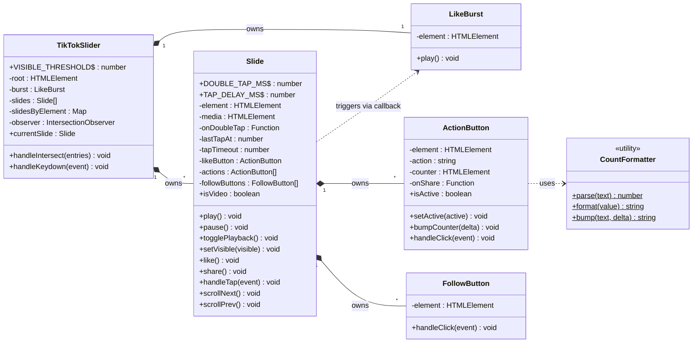
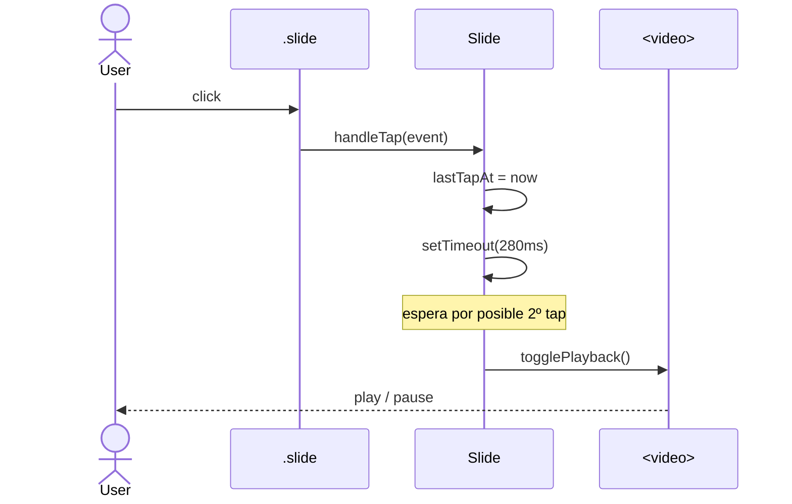
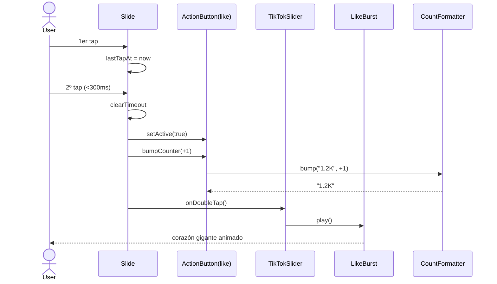
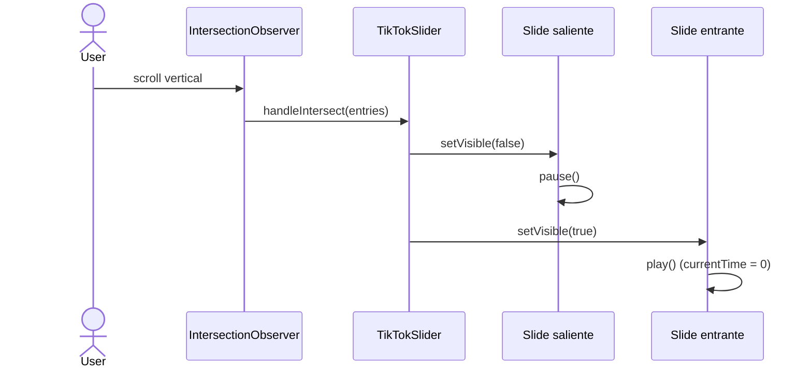
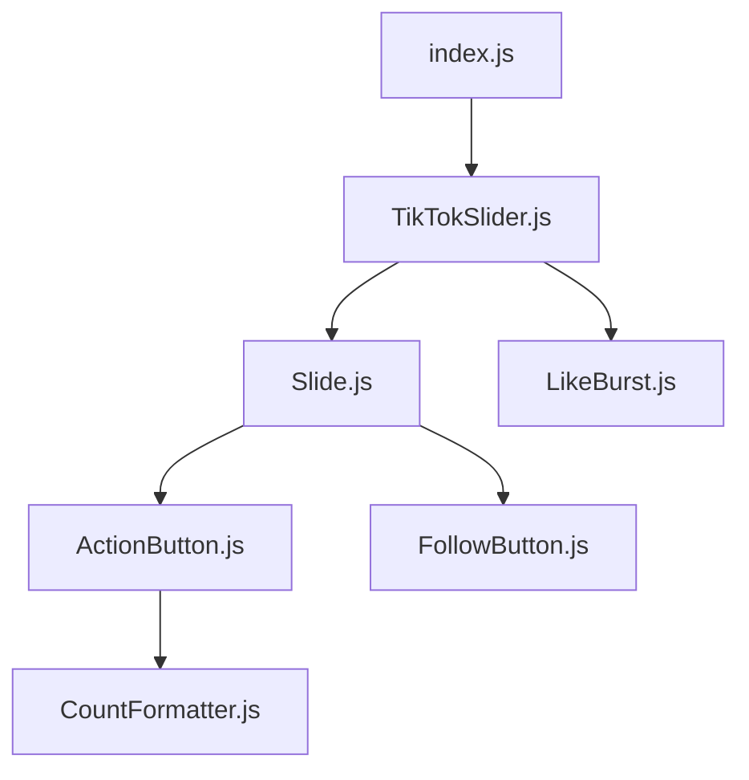

# Diagrama de clases — Slider TikTok

## Vista general



## Flujos de interacción

### Tap simple → play / pause



### Doble tap → like + animación



### Cambio de slide visible (scroll)



## Árbol de dependencias entre módulos



## Estructura de archivos

```
slider/
├── index.html
├── index.css
├── index.js                  # entry point: new TikTokSlider()
└── js/
    ├── CountFormatter.js     # utilidad estática (1.2K, 3M…)
    ├── LikeBurst.js          # animación de corazón gigante
    ├── ActionButton.js       # botones laterales (like, bookmark, share, comment)
    ├── FollowButton.js       # botón "+" del avatar
    ├── Slide.js              # un slide: tap/double-tap, play/pause, like
    └── TikTokSlider.js       # orquestador: IntersectionObserver + teclado
```

## Responsabilidades por capa

| Capa            | Clase           | Conoce a            | No conoce a          |
| --------------- | --------------- | ------------------- | -------------------- |
| **Aplicación**  | `TikTokSlider`  | `Slide`, `LikeBurst`| ActionButton, DOM detalle |
| **Entidad**     | `Slide`         | `ActionButton`, `FollowButton` | `TikTokSlider`, `LikeBurst` (solo callback) |
| **Componentes** | `ActionButton`  | `CountFormatter`    | `Slide`, otros botones |
| **Componentes** | `FollowButton`  | —                   | resto del sistema    |
| **Componentes** | `LikeBurst`     | —                   | resto del sistema    |
| **Utilidad**    | `CountFormatter`| —                   | DOM completo         |

> El sentido de las flechas es siempre de fuera hacia dentro: `TikTokSlider` conoce a `Slide`, pero `Slide` **no** conoce a `TikTokSlider` (solo recibe un callback `onDoubleTap`). Esto permite testear cada clase aisladamente y reutilizarlas.
